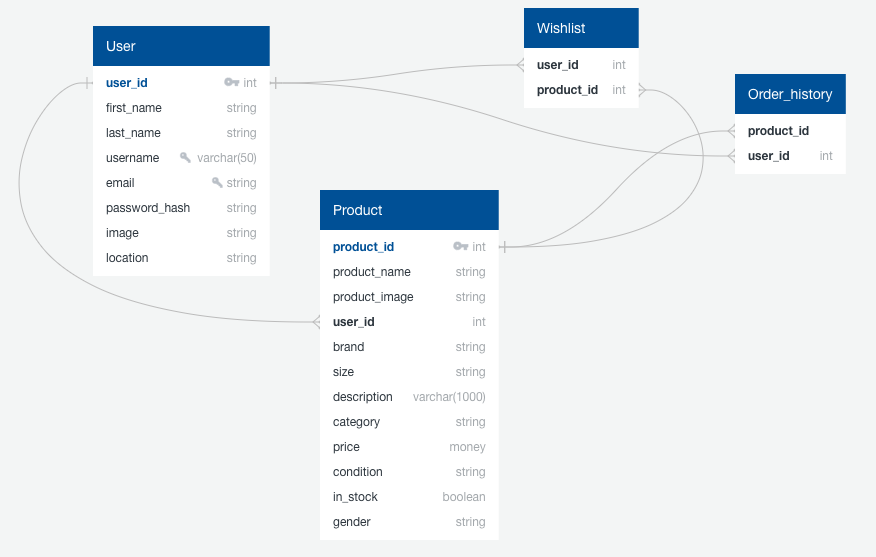
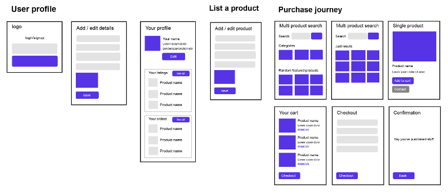
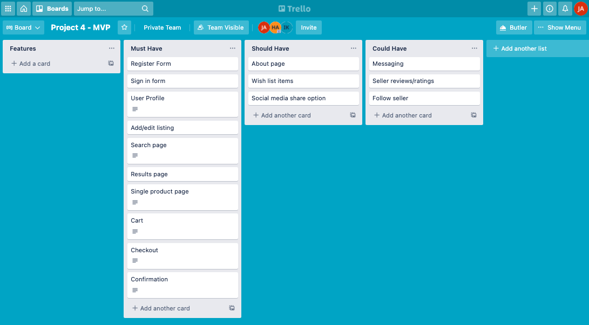

###  General Assembly, Software Engineering Immersive
# Garms

## Overview


Check it out [here](https://ja-garms.herokuapp.com/)

## The Brief

* **Build a full-stack application** by making your own back-end and your own front-end
* **Use an Flask API** to serve your data from a Postgres database
* **Consume your API with a separate front-end** built with React
* **Be a complete product** which most likely means multiple relationships and CRUD functionality for at least a couple of models
* **Implement thoughtful user stories/wireframes** that are significant enough to help you know which features are core MVP and which you can cut
* **Be deployed online** so it's publicly accessible.

## Technologies Used

### Back-end:
- Python
- Flask
- Flask SQLAlchemy
- Blueprint
- Marshmallow
- JWT
- PyTest

### Frontend:
- React.js
- Axios
- Webpack
- React-router-dom
- React-Hooks
- Bulma
- Nodemailer

### Development tools:
- VS code
- Pipenv/npm
- Insomnia
- Git
- Github
- Google Chrome dev tools
- Heroku (deployment)
- Trello Board (planning and timeline)
- PhotoShop (wireframing)
- Zoom
- Slack

## Approach taken

### Day 1 - Planning

As a group we decided very quickly on the idea of Garms for this project and that we all wanted to be involved in the full-stack development of the app. We also decided early on that we should develop it to be fully responsive initially built mobile first. With that in mind we used photoshop to create a storyboard/wireframe as well QuickDBD for the models we required and the relationships between them.


  

  
We decided early on to keep a high level of communication throughout the project. We started each day with a 30-minute stand up discussion where we would talk about our current tasks and if we had any blockers. We were then on a Zoom meeting and Slack throughout the day so we could keep in contact should we need any quick bug fixing etc. We used Git and GitHub for version control and decided for the first few days to do our pushes and pulls together to aviod any potential Git issues or merge conflicts that may arise. We delegated the work evenly between us and used Trello to create a to-do list that we would all keep on top of throughout the project.



### Back-end - Day 2 & 3

This was my first experience of creating a back-end using Python. We used Flask REST Framework to create a PostgreSQL database with RESTful features. As Python and Flask were new technologies to us, we all wanted to increase our experience. Therefore, we pair (triple) programmed the backend.

As a result of our substantial planning, we were confident in the relationships between each of our models. There were four models in total (product, user, wishlist and order history), as well as the base model.

Below is the product model, and it was important here to ensure the ForiegnKey and relationships between models were correct. One area I found challenging intially was the cascading e.g. if a user account was deleted, this should not delete the product as this would still need to show in a buyer's account. Once I understood this, finalising the models was much easier.

```py
class Product(db.Model, BaseModel):
    __tablename__ = "product"

    product_name = db.Column(db.Text, nullable=False)
    product_image = db.Column(db.Text, nullable=False)
    brand = db.Column(db.Text, nullable=True)
    size = db.Column(db.Text, nullable=False)
    description = db.Column(db.Text, nullable=True)
    category = db.Column(db.Text, nullable=False)
    price = db.Column(db.Float, nullable=False)
    condition = db.Column(db.Text, nullable=False)
    in_stock = db.Column(db.Boolean, nullable=False)
    gender = db.Column(db.Text, nullable=False)
    user_id = db.Column(db.Integer, db.ForeignKey("users.id", ondelete="CASCADE"))

    wishlist = db.relationship('Wishlist', backref='product', cascade="all, delete")
    order_history = db.relationship('OrderHistory', backref='product', cascade="all, delete")
```

Once we had the models set up, we split the controllers that would be required and all wrote a proportion each. I took ownership of the product and user controllers.

Serializers were also created and these were tested in Table Plus to ensure we had all the required data. Due to the relationships between tables, all schemas had nested fields. To ensure that there were no circular import errors, 'simple' schemas were created. An example of this is below; in the user schema, the product, order history and wishlist IDs were nested. We wanted to be able to see the ID of the user which a product related to, so SimpleUserSchema was created so that this could be nested within the ProductSchema.

```py
from app import ma
from models.user import User
from marshmallow import fields

class UserSchema(ma.SQLAlchemyAutoSchema):

    class Meta:
        model = User
        load_instance = True
        exclude = ('password_hash',)
        load_only = ('password')

    password = fields.String(required=True)
    product = fields.Nested('ProductSchema', many=True)
    order_history = fields.Nested('OrderHistorySchema', many=True)
    wishlist = fields.Nested('WishlistSchema', many=True)

    class SimpleUserSchema(ma.SQLAlchemyAutoSchema):
        class Meta:
            model = User
            load_instance = True
            exclude = ('password_hash', 'first_name', 'last_name', 'location', 'created_at')
            load_only = ('email', 'password')

        password = fields.String(required=True)
```

Pytest was used for the testing on the backend, and each endpoint had a test associated to it; by the end of the project, all 16 tests passed. Testing was very important to us as we wanted to limit the amount of debugging time when writing the controllers for our backend. By having clear tests for each controller we could make sure that each endpoint would behave excatly as we expected before writing any code.

```py
from app import app, db
import json
from tests.lib import login

def test_get_user():

    client = app.test_client()
    response = client.get("/api/users")

    assert len(response.json) == 4
    assert response.status_code == 200

def test_single_user():

    client = app.test_client()
    response = client.get("/api/users/1")

    assert response.json['username'] == 'indiak'
    assert response.status_code == 200 

def test_signup():

    client = app.test_client()

    user_data = {"username": "sam", "email": "sam@sam.com", "password": "sam123", "first_name": "Sam", "last_name": "Jones", "image": "TODO", "location": "London"}
    user_response = client.post(
        "/api/signup",
        data=json.dumps(user_data),
        content_type="application/json"
    )

    assert user_response.json['username'] == 'sam'
    assert user_response.status_code == 201

def test_login():

    client = app.test_client()

    login_data = {"password": "jake123", "email": "jake@jake.com"}
    response = client.post(
        "/api/login",
        data=json.dumps(login_data),
        content_type="application/json"
    )

    assert response.json["message"] == "Welcome back!"
    assert response.status_code == 200

def test_delete_user():

    client = app.test_client()

    login_data = {"password": "ben123", "email": "ben@ben.com"}
    login_response = client.post(
        "/api/login", data=json.dumps(login_data), content_type="application/json"
    )
    token = login_response.json["token"]

    user_data = {"username": "ben", "email": "ben@ben.com", "password": "ben123", "first_name": "Ben", "last_name": "Simpson", "image": "TODO", "location": "London"}
    request_headers = {"Authorization": f"Bearer {token}"}

    user_response = client.delete(
        "/api/users/4",
        data=json.dumps(user_data),
        content_type="application/json",
        headers=request_headers,
    )

    assert user_response.json['message'] == 'User deleted successfully'
    assert user_response.status_code == 200

def test_update_user():

    client = app.test_client()  

    token = login(client)

    update_request = {"location": "Sydney"}
    request_headers = {"Authorization": f"Bearer {token}"}
    user_response = client.put(
        "/api/users/2",
        data=json.dumps(update_request),
        content_type="application/json",
        headers=request_headers,
    )

    assert user_response.json["location"] == "Sydney"
    assert user_response.status_code == 200
```

### Front-end - Day 4, 5, 6, 7

Once the back end was complete, we split the front end tickets which had been created in Trello. I will discuss the pages which I took ownership of, and I also supported India and Hannah with de-bugging the other pages. For styling, we decided to use Bulma due to it being a mobile first framework.

# Registration & login 

Registration had to allow a user to creat a profile by filling out a form and submitting the data to our database, for this we used 'React-forms'. By using React-forms we could benefit from built in validation on each input field, this would make sure that the user would input data in the way in which we would like it to be stored.

### Deployment

The app was then deployed through Heroku. Initially we linked up the front-end to the back-end and tested locally, and once we were happy with this then hit the deploy button on Heroku through the CLI. Once the app was then deployed online we seeded in the relevent data.

## Challenges


## Wins

## Key Learnings


## Future Improvements

